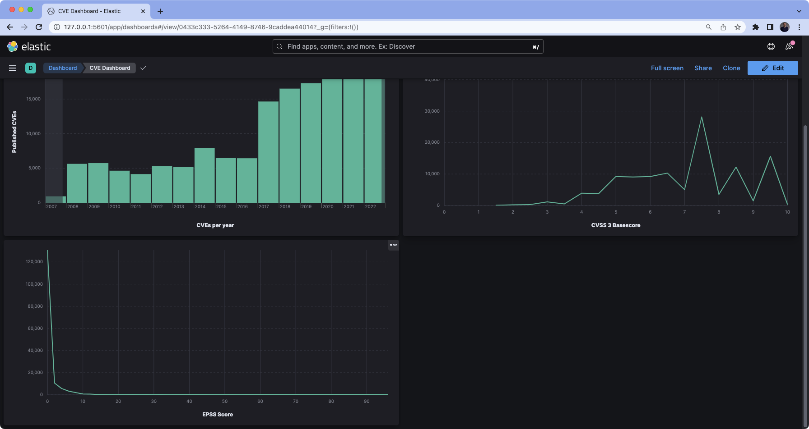

# CVElk - Vulnerability Intelligence Platform

[](https://www.python.org/downloads/)
[](https://opensource.org/licenses/MIT)
[](https://www.elastic.co/)

A modern vulnerability intelligence platform that aggregates CVE data from multiple authoritative sources into Elasticsearch with a Kibana dashboard. **Auto-updates every 15 minutes** to keep your data fresh.



## ✨ Features

- **387,000+ CVEs** available from the CVE List V5 repository
- **Auto-Updating** - Watch mode syncs every 15 minutes automatically
- **16-Panel Kibana Dashboard** with real-time vulnerability intelligence
- **4 Data Sources** - CVE List V5, NVD, EPSS, and CISA KEV
- **Simple Setup** - 4 commands to get running
- **Modern Python CLI** - Beautiful interface with rich output

## 🚀 Quick Start

```bash
# 1. Configure and start secure Elasticsearch and Kibana
cp docker/.env.example docker/.env
# Edit docker/.env and set strong passwords and a 32+ character encryption key.
cd docker && docker compose up -d && cd ..

# 2. Sync CVE data (the full sync can take several hours without an NVD API key)
python -m cvelk sync

# 3. Setup the dashboard
python -m cvelk setup

# 4. Open the dashboard
open http://localhost:5601/app/dashboards#/view/cvelk-main-dashboard
```

### 🔄 Auto-Update Mode

Keep your CVE data fresh with automatic updates:

```bash
# Start watching for updates (every 15 minutes)
cvelk watch

# Custom interval (every 5 minutes)
cvelk watch --interval 5

# Include NVD enrichment (slower but more complete)
cvelk watch --no-skip-nvd
```

The watch mode runs continuously. With NVD enrichment skipped, it uses incremental
CVE List V5 synchronization after the first successful run. A full NVD crawl is
rate-limited unless `NVD_API_KEY` is configured.

## 📊 Data Sources

CVElk aggregates vulnerability data from four authoritative sources:

| Source | Description | Records | Update Frequency |
|--------|-------------|---------|------------------|
| [CVE List V5](https://github.com/CVEProject/cvelistV5) | Official CVE Project repository - primary source for CVE records | ~387,000 CVEs | **Every 7 minutes** |
| [NVD](https://nvd.nist.gov/) | NIST National Vulnerability Database - CVSS scores, CWEs, references | ~320,000 CVEs | Real-time API |
| [EPSS](https://www.first.org/epss/) | Exploit Prediction Scoring System - probability of exploitation | ~369,000 scores | **Daily** |
| [CISA KEV](https://www.cisa.gov/known-exploited-vulnerabilities-catalog) | Known Exploited Vulnerabilities - actively exploited CVEs | ~1,700 CVEs | As needed |

> **Note**: The CVE List V5 is the authoritative source maintained by the CVE Project and updates every 7 minutes. CVElk's `watch` command syncs every 15 minutes by default to capture all updates.

### Data Enrichment

Each CVE record is enriched with:

- **CVSS Scores** - Base scores from CVSS v2.0, v3.0, v3.1, and v4.0
- **Severity Levels** - Critical, High, Medium, Low based on CVSS
- **CWE Mappings** - Common Weakness Enumeration classifications
- **EPSS Score** - Probability of exploitation in the next 30 days
- **KEV Status** - Whether the CVE is in CISA's Known Exploited Vulnerabilities catalog
- **KEV Details** - Date added, ransomware usage, required action deadline
- **Attack Vectors** - Network, Adjacent, Local, Physical
- **Vulnerability Status** - Published, Modified, Analyzed, Rejected

## 📈 Dashboard Panels

The CVElk dashboard provides comprehensive vulnerability intelligence:

| Panel | Description |
|-------|-------------|
| **Total CVEs** | Total count of indexed vulnerabilities |
| **Critical** | CVEs with CVSS score ≥ 9.0 |
| **High** | CVEs with CVSS score 7.0-8.9 |
| **Medium** | CVEs with CVSS score 4.0-6.9 |
| **In CISA KEV** | Known exploited vulnerabilities |
| **High EPSS (>75)** | CVEs with >75% exploitation probability |
| **CVEs Over Time** | Stacked bar chart by severity over time |
| **Severity Distribution** | Donut chart breakdown |
| **Top Weakness Types (CWE)** | Most common vulnerability categories |
| **Top CNA Publishers** | Most active CVE Numbering Authorities |
| **CVSS Version Distribution** | Breakdown of v2.0/v3.0/v3.1/v4.0 |
| **Attack Vector** | Network vs Local vs Adjacent vs Physical |
| **EPSS Score Distribution** | Histogram of exploitation probabilities |
| **KEV Cumulative Growth** | Area chart of KEV additions over time |
| **CVSS Score Distribution** | Histogram of base scores |
| **Vulnerability Status** | Published, Modified, Analyzed breakdown |

## 📖 CLI Commands

```bash
# Full sync from all sources (recommended for initial setup)
cvelk sync

# Watch mode - auto-update every 15 minutes
cvelk watch

# Watch with custom interval
cvelk watch --interval 5      # Every 5 minutes
cvelk watch --interval 30     # Every 30 minutes

# Sync specific years only
cvelk sync --years 2024 --years 2023

# Process only CVE files changed since the last successful V5 sync
cvelk sync-v5 --incremental

# Skip NVD enrichment (much faster)
cvelk sync --skip-nvd

# Skip EPSS or KEV enrichment
cvelk sync --skip-epss --skip-kev

# Set up Kibana dashboard
cvelk setup

# Show statistics
cvelk stats

# Search for CVEs
cvelk search "log4j"
cvelk search CVE-2021-44228

# Show configuration
cvelk config
```

## ⚙️ Configuration

Configure via environment variables or `.env` file. For the secure Docker
deployment, copy `docker/.env.example` to `docker/.env` and set the required
passwords and `ENCRYPTION_KEY`. The development Compose file does not require
credentials and is intended for local testing only.

| Variable | Description | Default |
|----------|-------------|---------|
| `ELASTICSEARCH_HOST` | Elasticsearch URL | `http://localhost:9200` |
| `KIBANA_HOST` | Kibana URL | `http://localhost:5601` |
| `NVD_API_KEY` | NVD API key (higher NVD rate limit) | - |
| `LOG_LEVEL` | Logging level | `INFO` |

### NVD API Key (Recommended)

Get a free API key for substantially faster NVD fetching:

1. Visit [NVD API Key Request](https://nvd.nist.gov/developers/request-an-api-key)
2. Set `NVD_API_KEY=your-key` in your environment

Without key: 5 requests/30 seconds | With key: 50 requests/30 seconds

EPSS values stored in Elasticsearch use percentages from `0` to `100`.
For example, `75` means a 75% exploitation probability.

## 🏗️ Architecture

```
┌─────────────────────────────────────────────────────────────────┐
│                        Data Sources                             │
├─────────────────┬─────────────────┬───────────────┬─────────────┤
│  CVE List V5    │    NVD API      │    EPSS       │  CISA KEV   │
│   (Primary)     │  (Enrichment)   │   (Scores)    │  (Exploited)│
│  ~387K CVEs     │  ~387K CVEs     │  ~369K scores │  ~1.7K CVEs │
└────────┬────────┴────────┬────────┴───────┬───────┴──────┬──────┘
         │                 │                │              │
         └─────────────────┴────────────────┴──────────────┘
                                   │
                            ┌──────▼──────┐
                            │   CVElk     │
                            │  (Python)   │
                            └──────┬──────┘
                                   │
                      ┌────────────▼────────────┐
                      │     Elasticsearch       │
                      │        9.5.3           │
                      │    CVE documents    │
                      │       varies by sync          │
                      └────────────┬────────────┘
                                   │
                      ┌────────────▼────────────┐
                      │        Kibana           │
                      │        9.5.3           │
                      │    16-Panel Dashboard   │
                      └─────────────────────────┘
```

## 🧪 Development

```bash
# Clone and install
git clone https://github.com/jgamblin/CVElk.git
cd CVElk
pip install -e ".[dev]"

# Development commands
make lint        # Run linter
make test        # Run tests
make format      # Format code
make type-check  # Type checking
```

## 📜 License

MIT License - see [LICENSE](LICENSE) for details.

## 👤 Author

**Jerry Gamblin** - [@jgamblin](https://twitter.com/jgamblin)

## 🙏 Acknowledgments

- [CVE Project](https://github.com/CVEProject/cvelistV5) - Authoritative CVE repository
- [NIST NVD](https://nvd.nist.gov/) - National Vulnerability Database
- [FIRST.org EPSS](https://www.first.org/epss/) - Exploit Prediction Scoring
- [CISA](https://www.cisa.gov/) - Known Exploited Vulnerabilities catalog
- [Elastic](https://www.elastic.co/) - Elasticsearch and Kibana
